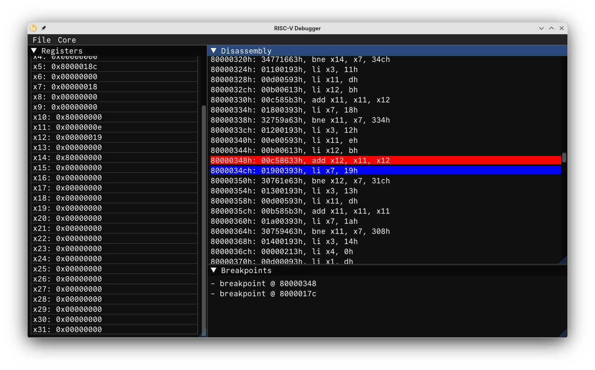

### For my understanding of riscv, check [this](riscv.md) out

### Currently all tests for `rv32u[mi]-p-*` pass. `u` - user-level, `i` - integer, `m` - multiplication/division instructions `p` - no virtual memory, single core.

### Basic dependencies
```
c++ compiler supporting >= c++23
```

### To build and run the emulator alone with [tests](https://github.com/riscv-software-src/riscv-tests):
```
git clone https://github.com/wwsmiff/riscv
cd riscv/
cd src/riscv
make
chmod +x fetch_tests.sh
./fetch_tests.sh
chmod +x run_tests.sh
./run_tests.sh
```

### Also comes with a basic debugger:

It supports
- Opening binary (.bin not elf) files (rv32im compatible)
- Run
- Breakpoints
- Pause
- Step
- Restart

###### Debugger dependencies:
- ImGui
- GLFW
- OpenGL
- portable-file-dialog
- glad

(all of the above are cloned when building the debugger)

### To build and run the debugger (only single core for now)
```
git clone https://github.com/wwsmiff/riscv
cd riscv
cd src/dbg
cmake -S . -B build
cmake --build build [-j$(nproc)]
./build/riscv-dbg
```

### License
[glad](https://github.com/Dav1dde/glad/blob/glad2/LICENSE)
[imgui](https://github.com/ocornut/imgui/blob/master/LICENSE.txt)
[commit-mono](https://github.com/eigilnikolajsen/commit-mono/blob/main/LICENSE)
[glfw](https://github.com/glfw/glfw/blob/master/LICENSE.md)
[pfd](https://github.com/samhocevar/portable-file-dialogs?tab=WTFPL-1-ov-file#readme)
